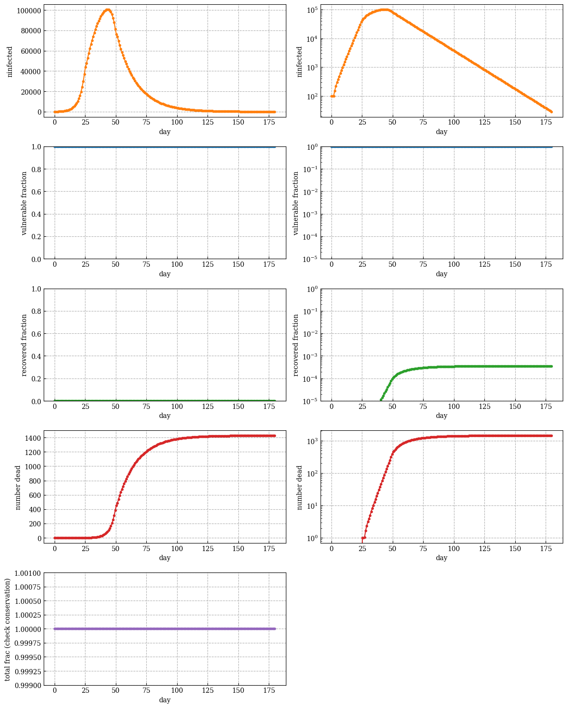
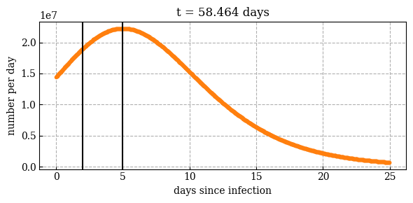
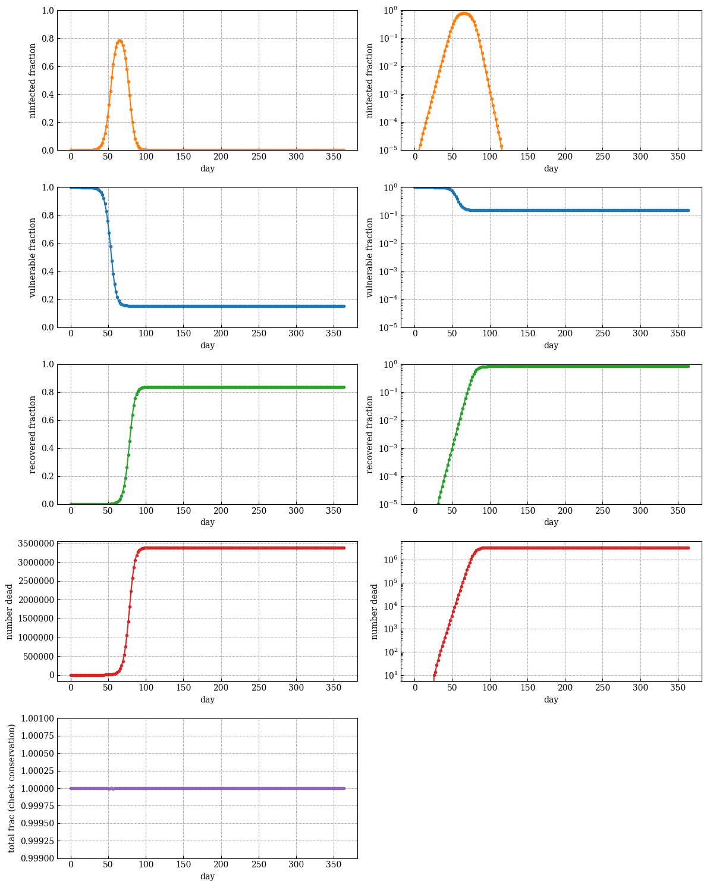

# A dumb and simple disease model

## Run
Modify parameters in `def.h` then
```
make plot
```
* `img/discete_timeseries.png` shows plots
* `img/infected_%05d.png` shows number of people per day vs day since infection

## Examples




## Deps
* c compiler
* python numpy
* python matplotlib
