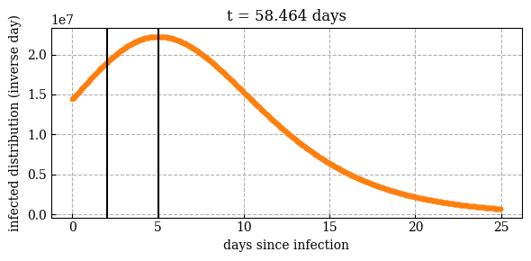

# A dumb and simple disease model

## Examples



## Run
Modify parameters in `def.h` then
```
make plot
```

## Output
* `img/discete_timeseries.png` shows nice plots
* `img/infected_%05d.png` shows number of people per day vs day since infection

## Deps
* c compiler
* python numpy
* python matplotlib
